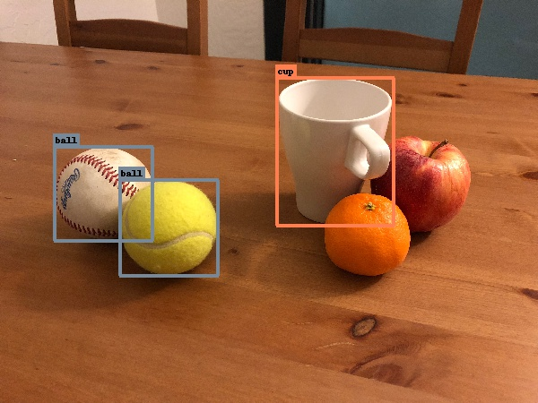

[image1]: /images/ground_truth.jpg "Facial Keypoint Detection"

# TF2 Object Detection API

This repository contains a simple Google Colab implementation of the TF Object Detection API. The main idea is to support fast prototyping and model selection without the need of setup the API in a local or cloud machine.

<p align="center">
  
</p>


## Project Overview

The main file of the project is the Colab notebook. It is can be runned direcly in Colab by using the badge on top. The code developed allow the user to starting from the annotated dataset and reproduce all the required steps: preparation, training and inference.

## Instructions

#### Dataset preparation
The very first step on any object detector is the data collection and annotation. To perform annotation it is required to use PascalVOC. It is recommended the usa of LabelImg.
[LabelImg](https://github.com/tzutalin/labelImg) can be easily implemented inside an Anaconda environment.  

```
conda create -n labelimg python=3.6 -y
conda activate labelimg
pip install labelimg
```

to run the GUI of LabelImg inside the environment

```
labelimg
```

point the GUI to the image folder and select as output another folder (the default name is annotation)

#### Model training
Load the two folders inside Google Drive. Open the notebook provided in this repo (__TensorFlow2_Object_Detection_API.ipynb__) inside Google Colab (adjust the paths and parameters as needed) and follow the steps reported.


## Future improvemets

- Implement TF2 graph inference to improve speed
- Review functions and report them inside this git repo
- Simplify the handling of paths
